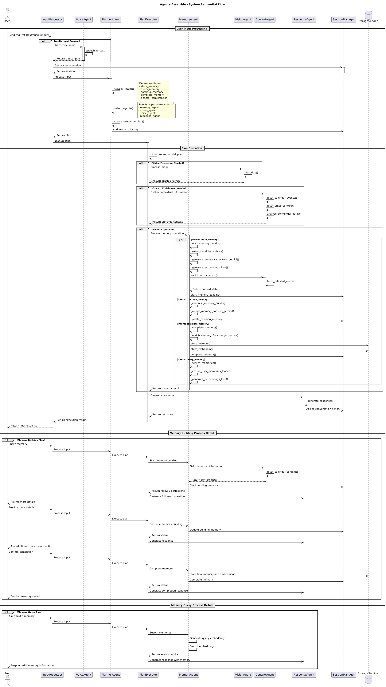

# Agents Assemble - Life Witness Agent

Agents Assemble is an intelligent memory management system that helps users capture, store, and retrieve important life events through natural conversation. The system utilizes a multi-agent architecture powered by Google's Generative AI to create a personal "life witness" that remembers events, people, and contexts with rich detail.

## Project Overview

The Life Witness Agent allows users to:

- **Store memories** through natural conversation or by uploading photos
- **Enrich memories** with contextual information from calendar and email
- **Ask follow-up questions** to add more details to memories
- **Query memories** later using natural language
- **Receive contextually rich responses** that recall precise details

## System Architecture

The system is designed as a collection of specialized AI agents orchestrated by a central planning and execution mechanism:

```
┌─────────────────┐       ┌───────────────┐       ┌────────────────┐
│   User Input    │       │ Plan Creation │       │ Plan Execution │
│ ┌─────────────┐ │       │ ┌───────────┐ │       │ ┌────────────┐ │
│ │   Voice     │─┼───────┼─▶ PlannerAgt│─┼───────┼─▶ Orchestrate│ │
│ └─────────────┘ │       │ └───────────┘ │       │ └────────────┘ │
│ ┌─────────────┐ │       │               │       │                │
│ │   Text      │─┼───────┼───────────────┼───────┼─▶              │
│ └─────────────┘ │       │               │       │                │
│ ┌─────────────┐ │       │               │       │ ┌────────────┐ │
│ │   Photos    │─┼───────┼───────────────┼───────┼─▶ Specialized│ │
│ └─────────────┘ │       │               │       │ │   Agents   │ │
└─────────────────┘       └───────────────┘       └────────────────┘
```

## Core Modules

### Backend Core

- **InputProcessor**: Central entry point for all user requests, handles voice transcription, session management, and orchestrates the overall request flow.
- **PlanExecutor**: Orchestrates agent execution based on plans created by the PlannerAgent, managing sequential and parallel agent execution.
- **SessionManager**: Maintains conversation state, handles pending memories, and provides session persistence.

### AI Agents

- **PlannerAgent**: The "brain" of the system that analyzes user intent and creates execution plans.
- **MemoryAgent**: Manages memory storage, continuation, completion, and retrieval using vector embeddings.
- **VisionAgent**: Analyzes images to extract visual information and enrich memories.
- **VoiceAgent**: Processes speech audio and converts it to text using Google Speech-to-Text.
- **ContextAgent**: Gathers contextual information from calendar and email to enrich memories.
- **ResponseAgent**: Generates natural language responses based on agent outputs.

### Services & Storage

- **StorageService**: Handles persistence of memories, embeddings, and session data.
- **GeminiService**: Provides access to Google Gemini AI models for various agent operations.

## Agent Descriptions

### PlannerAgent

The PlannerAgent serves as the system's strategic brain, analyzing user input to determine intent and create optimal execution plans.

**Key Features**:

- Intent classification (store/query/continue/complete memory)
- Dynamic agent selection based on input type and intent
- AI-powered execution planning with fallback mechanisms
- Session state management and context awareness

### MemoryAgent

The MemoryAgent manages the lifecycle of memory creation, enrichment, and retrieval using vector embeddings.

**Key Features**:

- Memory creation and structure generation
- AI-powered entity extraction
- Semantic search using vector embeddings
- Follow-up question generation for memory enhancement
- Memory completion and finalization

### VisionAgent

The VisionAgent analyzes images using Google's Gemini multimodal capabilities to extract visual information.

**Key Features**:

- Image analysis and description
- Object and person recognition
- Text extraction from images
- Visual context integration with memories

### VoiceAgent

The VoiceAgent handles speech-to-text conversion for voice inputs.

**Key Features**:

- Audio processing and transcription
- Speaker recognition (planned)
- Emotion detection from voice (planned)

### ContextAgent

The ContextAgent enriches memories with contextual information from external sources.

**Key Features**:

- Calendar event integration
- Email context retrieval
- Temporal context analysis
- Location and environment context

### ResponseAgent

The ResponseAgent generates natural language responses based on the outputs of other agents.

**Key Features**:

- Context-aware response generation
- Memory-based answer formulation
- Follow-up question generation
- Conversational continuity

## Component Interactions

```
┌─────────────┐
│    User     │
└──────┬──────┘
       │ ▲
       ▼ │
┌─────────────┐
│ InputProc   │
└──────┬──────┘
       │ ▲
       ▼ │
┌─────────────┐     ┌─────────────┐
│  PlannerAgt │────►│ PlanExecutor│
└─────────────┘     └──────┬──────┘
                           │ ▲
                           ▼ │
      ┌────────────────────┬─┴────────────────────┐
      │                    │                      │
      ▼                    ▼                      ▼
┌─────────────┐     ┌─────────────┐       ┌─────────────┐
│  MemoryAgt  │     │  VisionAgt  │       │ ContextAgt  │
└─────────────┘     └─────────────┘       └─────────────┘
      │                    │                      │
      └────────────┬───────┴──────────────┬──────┘
                   │                      │
                   ▼                      ▼
            ┌─────────────┐       ┌─────────────┐
            │ ResponseAgt │       │ SessionMgr  │
            └─────────────┘       └─────────────┘
```

## Sequence UML diagram



## Frontend Components

The frontend provides a user-friendly interface for interacting with the Life Witness Agent:

- **VoiceInterface**: Handles audio recording and playback
- **PhotoUpload**: Enables image uploads for memory enrichment
- **MemoryTimeline**: Displays memories in a chronological view
- **MemoryCard**: Renders individual memory details
- **AgentStatus**: Shows real-time agent activity

## Technology Stack

- **Backend**: Python, FastAPI
- **Frontend**: Next.js, React, TypeScript
- **AI**: Google Gemini API, Google Speech-to-Text
- **Vector Storage**: FAISS
- **External Services**: Google Calendar API, Gmail API

## Getting Started

### Prerequisites

- Python 3.9+
- Node.js 18+
- Google Cloud account with Gemini API access

### Installation

1. Clone the repository:

   ```
   git clone https://github.com/YourUsername/agents-assemble.git
   cd agents-assemble
   ```

2. Install backend dependencies:

   ```
   cd backend
   pip install -r requirements.txt
   ```

3. Set up environment variables:

   ```
   cp .env.example .env
   # Edit .env with your API keys
   ```

4. Install frontend dependencies:
   ```
   cd ../frontend
   npm install
   ```

### Running the Application

1. Start the backend server:

   ```
   cd backend
   python main.py
   ```

2. Start the frontend development server:

   ```
   cd frontend
   npm run dev
   ```

3. Open your browser and navigate to `http://localhost:3000`

## UML Diagrams

For detailed system flows and architecture, see the UML diagrams in the project:

- `agents-assemble-sequence-diagram.puml`: Main sequential flow
- `memory-operations-sequence-diagram.puml`: Memory operations
- `system-architecture-diagram.puml`: System components and relationships

## License

This project is licensed under the MIT License - see the LICENSE file for details.
